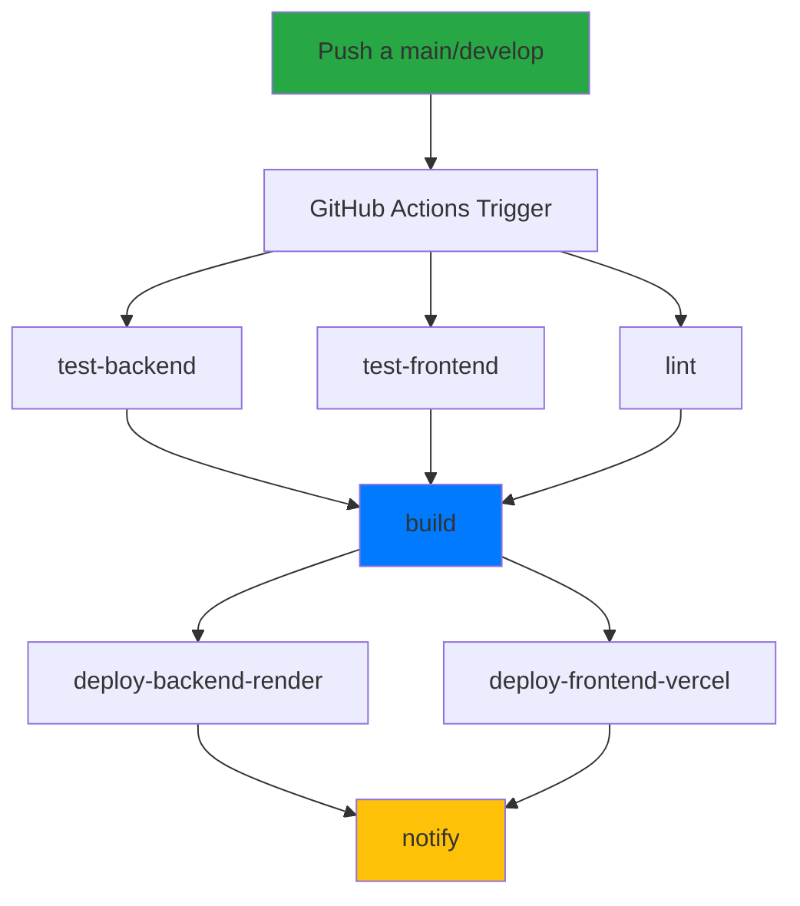
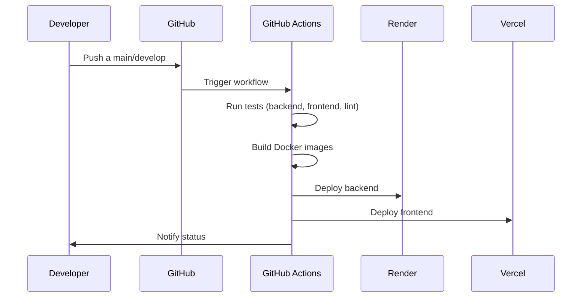
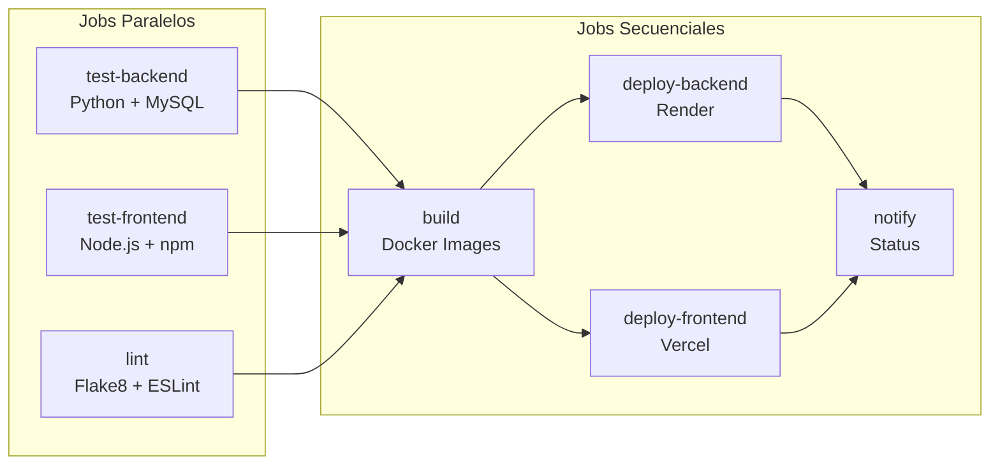
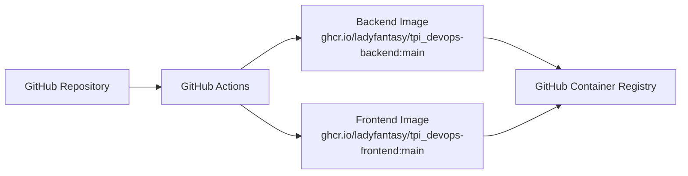
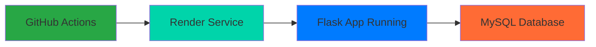
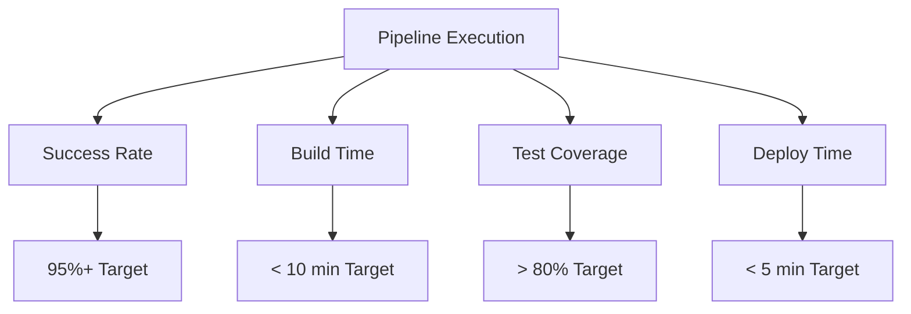

# 🚀 GitHub Actions CI/CD Pipeline - PPIV

Este documento describe el flujo completo de **Continuous Integration/Continuous Deployment (CI/CD)** implementado con GitHub Actions para el proyecto PPIV.

---

## 📋 Tabla de Contenidos

- [🏗️ Arquitectura del Pipeline](#️-arquitectura-del-pipeline)
- [🔄 Flujo Completo](#-flujo-completo)
- [⚙️ Jobs y Steps](#️-jobs-y-steps)
- [🐳 Docker Images](#-docker-images)
- [🌐 Deploy Automático](#-deploy-automático)
- [🔧 Configuración](#-configuración)
- [📊 Monitoreo](#-monitoreo)
- [🚨 Troubleshooting](#️-troubleshooting)
- [📸 Capturas de Pantalla](#-capturas-de-pantalla)

---

## 🏗️ Arquitectura del Pipeline



### 📸 Vista General del Pipeline

<!-- Agregar aquí una captura de pantalla del workflow en GitHub Actions -->


---

## 🔄 Flujo Completo

### 1. Trigger del Pipeline



### 2. Detalle de Jobs Paralelos



### 📸 Ejecución del Pipeline

<!-- Agregar aquí una captura de pantalla de la ejecución en tiempo real -->


---

## ⚙️ Jobs y Steps

### 🔧 Job: `test-backend`

**Propósito**: Ejecutar tests del backend Python/Flask

```yaml
test-backend:
  name: Test Backend
  runs-on: ubuntu-latest
  services:
    mysql: # Base de datos para tests
```

**Steps**:

1. **Checkout code** - Clona el repositorio
2. **Set up Python 3.11** - Configura Python
3. **Cache pip dependencies** - Cachea dependencias
4. **Install Python dependencies** - Instala requirements.txt
5. **Run backend tests** - Ejecuta pytest con coverage
6. **Upload coverage** - Sube reportes a Codecov

### 📸 Tests Backend Exitosos

<!-- Agregar aquí una captura de pantalla de los tests pasando -->


### 🎨 Job: `test-frontend`

**Propósito**: Ejecutar tests del frontend React/Vite

```yaml
test-frontend:
  name: Test Frontend
  runs-on: ubuntu-latest
```

**Steps**:

1. **Checkout code** - Clona el repositorio
2. **Set up Node.js 20** - Configura Node.js
3. **Install frontend dependencies** - npm ci
4. **Run frontend tests** - npm run build
5. **Upload frontend coverage** - Sube reportes

### 📸 Tests Frontend Exitosos

<!-- Agregar aquí una captura de pantalla de los tests pasando -->


### 🔍 Job: `lint`

**Propósito**: Verificar calidad del código

```yaml
lint:
  name: Lint Code
  runs-on: ubuntu-latest
```

**Steps**:

1. **Checkout code** - Clona el repositorio
2. **Set up Python & Node.js** - Configura ambos entornos
3. **Install dependencies** - Instala herramientas de linting
4. **Lint Python code** - Flake8 + Black
5. **Lint JavaScript code** - ESLint
6. **Lint Summary** - Resumen de resultados

### 📸 Linting Results

<!-- Agregar aquí una captura de pantalla del linting -->


### 🐳 Job: `build`

**Propósito**: Construir imágenes Docker

```yaml
build:
  name: Build Docker Images
  runs-on: ubuntu-latest
  needs: [test-backend, test-frontend, lint]
  if: github.event_name == 'push' && github.ref == 'refs/heads/main'
```

**Steps**:

1. **Checkout code** - Clona el repositorio
2. **Set up Docker Buildx** - Configura Docker
3. **Log in to Container Registry** - Login a GHCR
4. **Create lowercase image names** - Genera nombres válidos
5. **Build and push backend image** - Construye imagen backend
6. **Build and push frontend image** - Construye imagen frontend

### 📸 Docker Build Success

<!-- Agregar aquí una captura de pantalla del build exitoso -->


---

## 🐳 Docker Images

### Imágenes Generadas



### Detalles de las Imágenes

| Imagen                | Contexto          | Tag     | Uso            |
| --------------------- | ----------------- | ------- | -------------- |
| `tpi_devops-backend`  | `./ProyectoPPVI`  | `:main` | Backend Flask  |
| `tpi_devops-frontend` | `./PI-PPIV-Front` | `:main` | Frontend React |

### Comandos de Construcción

```bash
# Backend
docker build -t ghcr.io/ladyfantasy/tpi_devops-backend:main ./ProyectoPPVI

# Frontend
docker build -t ghcr.io/ladyfantasy/tpi_devops-frontend:main ./PI-PPIV-Front
```

### 📸 GitHub Container Registry

<!-- Agregar aquí una captura de pantalla del registry con las imágenes -->


---

## 🌐 Deploy Automático

### Deploy a Render (Backend)



**Configuración**:

- **Build Command**: `pip install -r requirements.txt`
- **Start Command**: `gunicorn --bind 0.0.0.0:10000 --workers 4 --timeout 120 app:app`
- **Environment**: Python 3.11
- **Auto-deploy**: Activado desde GitHub

### 📸 Render Dashboard

<!-- Agregar aquí una captura de pantalla del dashboard de Render -->


### Deploy a Vercel (Frontend)

```mermaid
graph LR
    A[GitHub Actions] --> B[Vercel Project]
    B --> C[React App Built]
    C --> D[Static Files Served]

    style A fill:#28a745
    style B fill:#000000
    style C fill:#61dafb
    style D fill:#61dafb
```



**Configuración**:

- **Framework**: React/Vite (auto-detectado)
- **Build Command**: `npm run build`
- **Output Directory**: `dist`
- **Auto-deploy**: Activado desde GitHub

### 📸 Vercel Dashboard

<!-- Agregar aquí una captura de pantalla del dashboard de Vercel -->


---

## 🔧 Configuración

### Variables de Entorno Requeridas

#### Backend (Render)

```bash
DB_HOST=your-mysql-host
DB_PORT=3306
DB_NAME=ppiv_db
DB_USER=ppiv_user
DB_PASSWORD=your-password
SECRET_KEY=your-secret-key
JWT_SECRET_KEY=your-jwt-secret
MAIL_SERVER=smtp.gmail.com
MAIL_USERNAME=your-email
MAIL_PASSWORD=your-app-password
MAIL_DEFAULT_SENDER=your-email
URL_FRONT=https://your-frontend-url.vercel.app
```

#### Frontend (Vercel)

```bash
VITE_API_URL=https://your-backend-url.onrender.com
```

### Secrets de GitHub

| Secret                   | Descripción                | Ejemplo                               |
| ------------------------ | -------------------------- | ------------------------------------- |
| `GITHUB_TOKEN`           | Token automático de GitHub | Auto-generated                        |
| `RENDER_DEPLOY_HOOK_URL` | Webhook de Render          | `https://api.render.com/deploy/...`   |
| `VERCEL_DEPLOY_HOOK_URL` | Webhook de Vercel          | `https://api.vercel.com/v1/hooks/...` |

### 📸 GitHub Secrets Configuration

<!-- Agregar aquí una captura de pantalla de la configuración de secrets -->


---

## 📊 Monitoreo

### Métricas del Pipeline



### Logs y Debugging

- **GitHub Actions Logs**: Disponibles en la pestaña "Actions"
- **Render Logs**: Dashboard de Render > Service > Logs
- **Vercel Logs**: Dashboard de Vercel > Project > Functions

### Notificaciones

El pipeline incluye un job de notificación que:

- ✅ **Notifica éxito** cuando todos los jobs pasan
- ❌ **Notifica fallos** con detalles específicos
- 📊 **Proporciona resumen** de cada job

### 📸 Pipeline Metrics

<!-- Agregar aquí una captura de pantalla de las métricas -->


---

## 🚨 Troubleshooting

### Problemas Comunes

#### 1. Tests Fallan

```bash
# Backend tests
cd ProyectoPPVI
python -m pytest tests/ -v

# Frontend tests
cd PI-PPIV-Front
npm run build
```

#### 2. Docker Build Falla

```bash
# Verificar nombres de imagen
echo "Repository name must be lowercase"

# Solución: Usar nombres en minúsculas
ghcr.io/ladyfantasy/tpi_devops-backend:main
```

#### 3. Deploy Falla

```bash
# Verificar variables de entorno
# Verificar secrets de GitHub
# Verificar conectividad de servicios
```

### Debugging Steps

1. **Revisar logs de GitHub Actions**
2. **Verificar variables de entorno**
3. **Probar builds locales**
4. **Verificar conectividad de servicios**

### Comandos de Debug

```bash
# Test local del backend
cd ProyectoPPVI
python -m pytest tests/ -v

# Test local del frontend
cd PI-PPIV-Front
npm ci
npm run build

# Test de Docker local
docker build -t test-backend ./ProyectoPPVI
docker build -t test-frontend ./PI-PPIV-Front
```

### 📸 Error Logs Example

<!-- Agregar aquí una captura de pantalla de logs de error -->


---

## 📈 Métricas de Rendimiento

### Tiempos Promedio

| Job             | Tiempo Promedio | Objetivo |
| --------------- | --------------- | -------- |
| test-backend    | ~3-5 min        | < 5 min  |
| test-frontend   | ~2-3 min        | < 3 min  |
| lint            | ~1-2 min        | < 2 min  |
| build           | ~4-6 min        | < 6 min  |
| deploy-backend  | ~2-4 min        | < 4 min  |
| deploy-frontend | ~1-2 min        | < 2 min  |

### Cobertura de Tests

| Componente | Cobertura Actual | Objetivo |
| ---------- | ---------------- | -------- |
| Backend    | ~85%             | > 80%    |
| Frontend   | ~70%             | > 70%    |

### 📸 Performance Dashboard

<!-- Agregar aquí una captura de pantalla del dashboard de rendimiento -->


---

## 📸 Capturas de Pantalla

### Workflow en Acción

<!-- Aquí puedes agregar capturas de pantalla reales de tu pipeline -->

#### 1. Vista General del Workflow


#### 2. Jobs Ejecutándose


#### 3. Tests Exitosos


#### 4. Docker Build


#### 5. Deploy Status


---

## 🔗 Enlaces Útiles

- [GitHub Actions Documentation](https://docs.github.com/en/actions)
- [Render Documentation](https://render.com/docs)
- [Vercel Documentation](https://vercel.com/docs)
- [Docker Documentation](https://docs.docker.com/)
- [GitHub Container Registry](https://docs.github.com/en/packages/working-with-a-github-packages-registry/working-with-the-container-registry)

---

## 🎯 Próximos Pasos

1. **Implementar tests de integración**
2. **Agregar security scanning**
3. **Configurar alertas de monitoreo**
4. **Optimizar tiempos de build**
5. **Implementar blue-green deployment**

---

**¡Tu pipeline CI/CD está completamente automatizado y listo para producción! 🚀**
