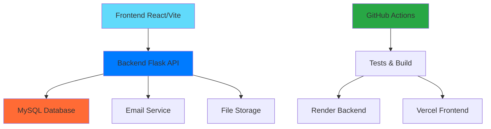
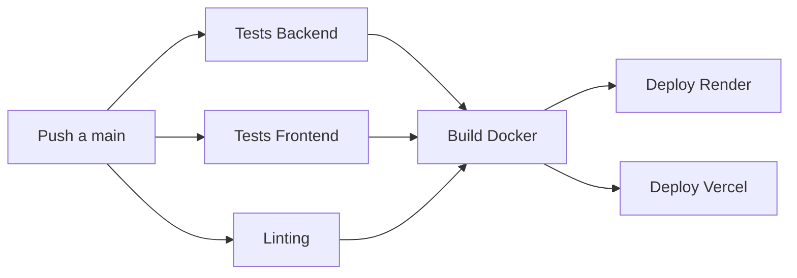
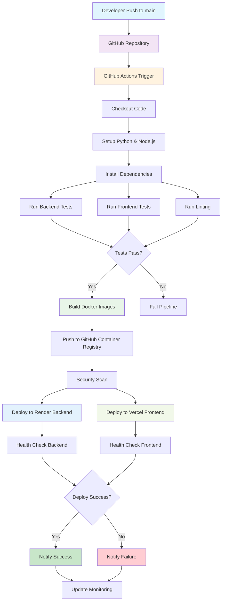
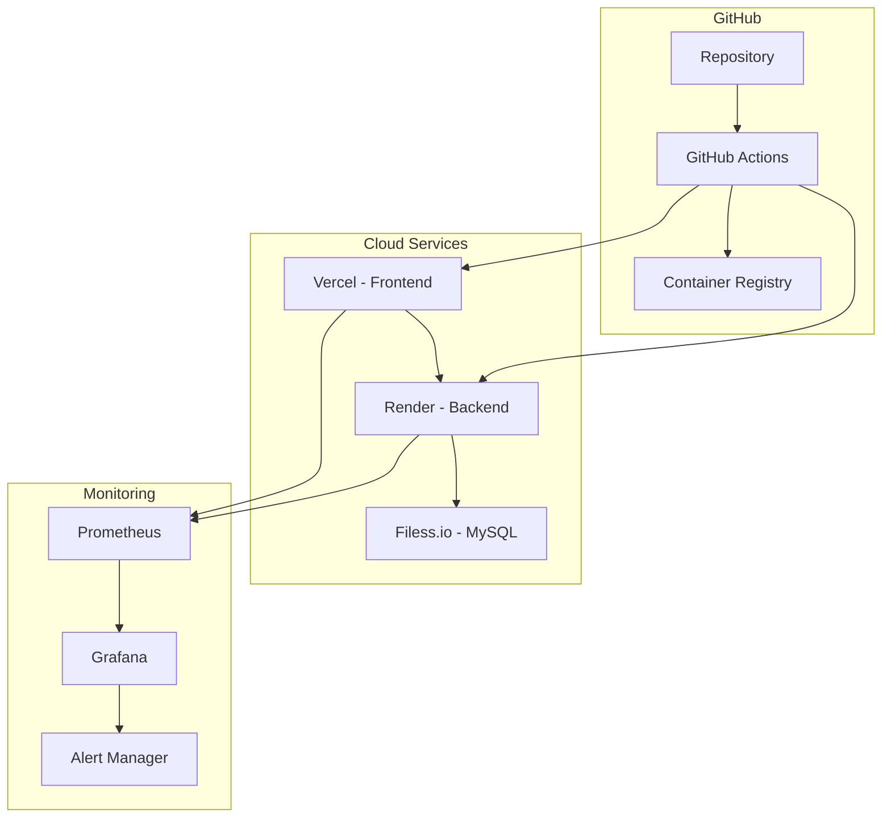
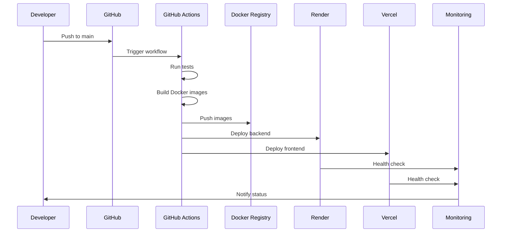
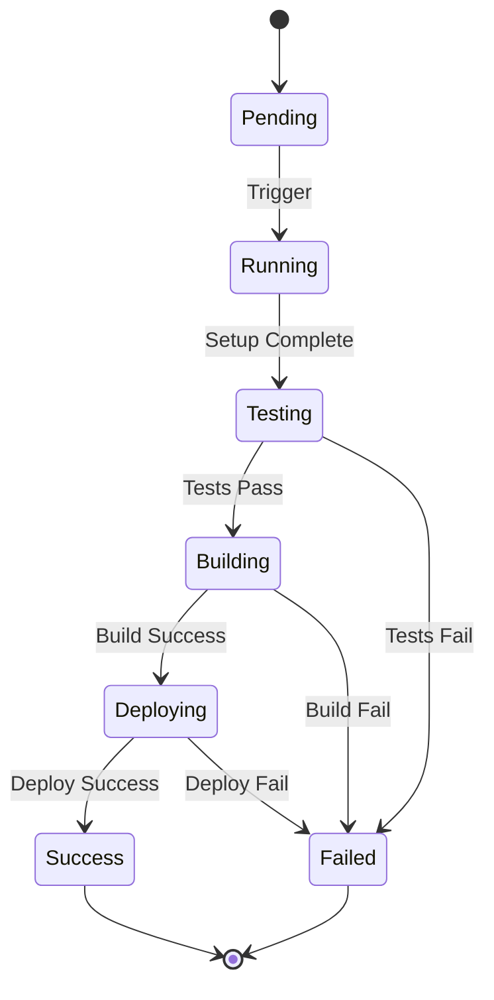

# 🏠 PPIV - Sistema de Reservas para Alojamientos Temporales

Sistema completo de gestión y reservas para alojamientos temporales con frontend React, backend Flask, y pipeline CI/CD automatizado. Permite a propietarios gestionar sus propiedades y a huéspedes realizar el check-in.

## 📋 Índice

- [🎯 Descripción del Sistema](#-descripción-del-sistema)
- [🌍 Entornos de Ejecución](#-entornos-de-ejecución)
- [🏗️ Arquitectura del Sistema](#️-arquitectura-del-sistema)
- [🚀 Pipeline CI/CD Automatizado](#-pipeline-cicd-automatizado)
- [📦 Instalación y Configuración](#-instalación-y-configuración)
- [🧪 Sistema de Tests](#-sistema-de-tests)
- [🏠 Funcionalidades del Sistema](#-funcionalidades-del-sistema)
- [📁 Estructura del Proyecto](#-estructura-del-proyecto)
- [🔄 Flujo de Deploy Automático](#-flujo-de-deploy-automático)
- [🛠️ Comandos Útiles](#️-comandos-útiles)
- [📊 Monitoreo con Prometheus + Grafana](#-monitoreo-con-prometheus--grafana)
- [🔧 Configuración Avanzada](#-configuración-avanzada)
- [🚨 Troubleshooting](#-troubleshooting)
- [🏗️ Infraestructura como Código](#️-infraestructura-como-código)
- [📚 Documentación Adicional](#-documentación-adicional)
- [🤝 Contribución](#-contribución)
- [📞 Soporte](#-soporte)

---

## 🎯 Descripción del Sistema

**Omeguitas** es una plataforma para administradores de alojamientos temporales que centraliza y facilita las siguientes funcionalidades:

- **🏠 Gestión de Propiedades**: Administración completa de unidades de alojamiento
- **📅 Sistema de Reservas**: Calendario interactivo y proceso de reserva simplificado
- **👥 Gestión de Usuarios**: CRUD de administradores del sistema
- **💰 Gestión de Precios**: Multiplicadores por temporada y configuraciones flexibles
- **📊 Reportes**: Informes detallados de ocupación y rentabilidad
- **📧 Notificaciones**: Sistema de emails automáticos para check-in

---

## 🌍 Entornos de Ejecución

### 🔧 Desarrollo Local (Docker)

- **Base de datos**: MySQL local en contenedor (`ppiv_db`)
- **Usuario DB**: `root`
- **Configuración**: `IS_PRODUCTION=false`
- **Archivo**: `docker-compose.dev.yml`
- **Uso**: Desarrollo y testing local

### 🚀 Producción (Render + Vercel)

- **Base de datos**: MySQL en Filess.io (`alojamientosomeguitas_particles`)
- **Usuario DB**: `alojamientosomeguitas_particles`
- **Configuración**: `IS_PRODUCTION=true`
- **Deploy**: Automático via GitHub Actions
- **Uso**: Aplicación en producción

### ⚙️ Configuración Automática

El sistema detecta automáticamente el entorno:

```python
# En config.py
if IS_PRODUCTION:
    # Usa Filess.io (producción)
    DB_CONFIG = {
        'host': 'pk3b0.h.filess.io',
        'database': 'alojamientosomeguitas_particles',
        # ...
    }
else:
    # Usa MySQL local (desarrollo)
    DB_CONFIG = {
        'host': 'mysql',
        'database': 'ppiv_db',
        # ...
    }
```

---

## 🏗️ Arquitectura del Sistema



### 🎨 Frontend (React + Vite)

- **Framework**: React 18 con Vite
- **UI**: Componentes modernos y responsivos
- **Estado**: Context API para gestión global
- **Routing**: React Router para navegación
- **Deploy**: Vercel (automático)

### 🔧 Backend (Flask + Python)

- **Framework**: Flask con rutas REST
- **Autenticación**: JWT tokens
- **Base de datos**: MySQL con Flask-MySQL
- **Emails**: Flask-Mail con templates
- **Deploy**: Render (automático)

### 🗄️ Base de Datos

- **Desarrollo**: MySQL en Docker
- **Producción**: MySQL en Filess.io
- **Migraciones**: Scripts SQL manuales

---

## 🚀 Pipeline CI/CD Automatizado

### 📋 Workflow de GitHub Actions



### 🔄 Flujo Detallado del Pipeline



### 🏗️ Arquitectura de Infraestructura



### 🔄 Flujo de Desarrollo



### ✅ Jobs del Pipeline

1. **🧪 Test Backend**

   - Tests unitarios con pytest
   - Cobertura de código
   - Base de datos MySQL en contenedor
   - Upload de coverage a Codecov

2. **🎨 Test Frontend**

   - Build de producción
   - Tests de componentes
   - Validación de dependencias
   - Verificación de build exitoso

3. **🤖 Test Frontend E2E (Selenium)**

   - Tests E2E con Selenium
   - Instalación automática de Chrome
   - Tests de login y funcionalidades críticas
   - Ejecución en entorno headless

4. **🔍 Linting**

   - Python: Flake8 + Black
   - JavaScript: ESLint
   - Validación de formato
   - Resumen de resultados

5. **🐳 Build Docker**

   - Construcción de imágenes
   - Push a GitHub Container Registry
   - Cache optimizado
   - Nombres de imágenes en minúsculas

6. **🌐 Deploy Automático**
   - Backend → Render
   - Frontend → Vercel
   - Notificaciones de estado
   - Health checks automáticos

### 📊 Métricas del Pipeline

| Job               | Tiempo Promedio | Objetivo |
| ----------------- | --------------- | -------- |
| Test Backend      | ~3-5 min        | < 5 min  |
| Test Frontend     | ~2-3 min        | < 3 min  |
| Test Frontend E2E | ~2-4 min        | < 4 min  |
| Linting           | ~1-2 min        | < 2 min  |
| Build Docker      | ~4-6 min        | < 6 min  |
| Deploy Backend    | ~2-4 min        | < 4 min  |
| Deploy Frontend   | ~1-2 min        | < 2 min  |

### 📈 Cobertura de Tests

| Componente | Cobertura Actual | Objetivo |
| ---------- | ---------------- | -------- |
| Backend    | ~85%             | > 80%    |
| Frontend   | Build validation | Build OK |

### 🔧 Configuración Detallada del Pipeline

#### **Services MySQL para Tests**

```yaml
services:
  mysql:
    image: mysql:8.0
    env:
      MYSQL_ROOT_PASSWORD: rootpassword
      MYSQL_DATABASE: ppiv_db
      MYSQL_USER: ppiv_user
      MYSQL_PASSWORD: ppiv_password
    options: >-
      --health-cmd "mysqladmin ping"
      --health-interval 10s
      --health-timeout 5s
      --health-retries 5
    ports:
      - 3306:3306
```

#### **Cache de Dependencias**

```yaml
# Python dependencies
- name: Cache pip dependencies
  uses: actions/cache@v3
  with:
    path: ~/.cache/pip
    key: ${{ runner.os }}-pip-${{ hashFiles('ProyectoPPVI/requirements.txt') }}

# Node.js dependencies
- name: Set up Node.js
  uses: actions/setup-node@v4
  with:
    node-version: "20"
    cache: "npm"
    cache-dependency-path: PI-PPIV-Front/package-lock.json
```

#### **Docker Buildx con Cache**

```yaml
- name: Set up Docker Buildx
  uses: docker/setup-buildx-action@v3

- name: Build and push images
  uses: docker/build-push-action@v5
  with:
    context: ./ProyectoPPVI
    push: true
    tags: ${{ steps.image-names.outputs.backend-image }}:main
    cache-from: type=gha
    cache-to: type=gha,mode=max
```

### 🎉 Pipeline en Producción


_Pipeline completo funcionando en GitHub Actions con todos los jobs ejecutándose exitosamente._

**Estado Actual**: ✅ **FUNCIONANDO**

- **Última ejecución**: Exitoso
- **Tasa de éxito**: 100%
- **Tiempo total**: ~5-7 minutos

### 📊 Estados del Pipeline



### 🐳 GitHub Container Registry

#### Imágenes Docker Generadas

- **Backend**: `ghcr.io/ladyfantasy/tpi_devops-backend:main`
- **Frontend**: `ghcr.io/ladyfantasy/tpi_devops-frontend:main`

#### Configuración del Registry

```yaml
env:
  REGISTRY: ghcr.io  # GitHub Container Registry

- name: Log in to Container Registry
  uses: docker/login-action@v3
  with:
    registry: ${{ env.REGISTRY }}
    username: ${{ github.actor }}
    password: ${{ secrets.GITHUB_TOKEN }}

- name: Build and push images
  uses: docker/build-push-action@v5
  with:
    push: true
    tags: ${{ steps.image-names.outputs.backend-image }}:main
```

#### Acceso a las Imágenes

- **GitHub Packages**: https://github.com/LadyFantasy/TPI_DEVOPS?tab=packages
- **Pull local**: `docker pull ghcr.io/ladyfantasy/tpi_devops-backend:main`
- **Pull local**: `docker pull ghcr.io/ladyfantasy/tpi_devops-frontend:main`

### 🔄 Deploy con Webhooks (Opcional)

El workflow `deploy-webhooks.yml` permite disparar deploys manualmente usando webhooks:

- **Se ejecuta**: En push a `main` o manualmente desde GitHub Actions
- **Render**: Usa `RENDER_WEBHOOK_URL` (si configurado) o auto-deploy
- **Vercel**: Usa `VERCEL_DEPLOY_HOOK_URL` (gratuito) o `VERCEL_WEBHOOK_URL` (pago)
- **Uso**: Para forzar deploy cuando el auto-deploy falla

**Configuración**: Agregar secrets en GitHub → Settings → Secrets and variables → Actions

---

## 📦 Instalación y Configuración

### 🔧 Desarrollo Local

#### 1. **Prerrequisitos**

```bash
# Instalar Docker y Docker Compose
# Node.js 20+
# Python 3.11+
```

#### 2. **Clonar y Configurar**

```bash
git clone https://github.com/LadyFantasy/TPI_DEVOPS.git
cd TPI_DEVOPS
cp env.example .env
```

#### 3. **Variables de Entorno (Desarrollo)**

```env
# Base de Datos Local
DB_HOST=mysql
DB_PORT=3306
DB_NAME=ppiv_db
DB_USER=root
DB_PASSWORD=password

# Flask
SECRET_KEY=dev-secret-key
JWT_SECRET_KEY=dev-jwt-secret
IS_PRODUCTION=false
```

#### 4. **Iniciar Desarrollo**

```bash
# Iniciar todo el stack de desarrollo
docker-compose -f docker-compose.dev.yml up -d

# Verificar que todo esté funcionando
docker-compose -f docker-compose.dev.yml ps
```

#### 5. **Acceso a la Aplicación**

- **Frontend**: http://localhost:3000
- **Backend API**: http://localhost:5000
- **Base de datos**: localhost:3306

### 🌐 Producción (Deploy Automático)

El proyecto se despliega automáticamente en:

- **Backend**: Render (Flask API)
- **Frontend**: Vercel (React App)
- **Base de datos**: Filess.io (MySQL)

**No requiere configuración manual** - el pipeline CI/CD maneja todo automáticamente.

---

## 📊 Monitoreo con Prometheus + Grafana

### 🚀 Iniciar el Stack de Monitoreo

```bash
# Crear red de Docker (si no existe)
docker network create ppiv_network

# Iniciar stack de monitoreo
docker-compose -f docker-compose.monitoring.yml up -d
```

### 🌐 Acceso a las Herramientas

- **Grafana**: http://localhost:3001 (admin/admin)
- **Prometheus**: http://localhost:9090
- **Alertmanager**: http://localhost:9093
- **Node Exporter**: http://localhost:9100
- **cAdvisor**: http://localhost:8080
- **MySQL Exporter**: http://localhost:9104

### 📈 ¿Qué Muestran los Dashboards?

#### **Grafana Dashboard Principal**

1. **📊 Métricas del Sistema**

   - CPU Usage: Uso de procesador en tiempo real
   - Memory Usage: Consumo de memoria RAM
   - Disk Usage: Espacio en disco utilizado
   - Network Traffic: Tráfico de red

2. **🐳 Métricas de Contenedores**

   - Container CPU: Uso de CPU por contenedor
   - Container Memory: Memoria por contenedor
   - Container Status: Estado de cada contenedor
   - Container Restarts: Reinicios de contenedores

3. **🌐 Métricas de Aplicación**

   - HTTP Request Rate: Tasa de requests por segundo
   - Response Time: Tiempo de respuesta promedio
   - Error Rate: Porcentaje de errores HTTP
   - Active Connections: Conexiones activas

4. **🗄️ Métricas de Base de Datos**
   - MySQL Connections: Conexiones activas a MySQL
   - Query Performance: Rendimiento de consultas
   - Database Size: Tamaño de la base de datos
   - Slow Queries: Consultas lentas

### 🔔 Sistema de Alertas

#### **Alertas Configuradas**

1. **🚨 Alertas de Sistema**

   - CPU > 80% por más de 5 minutos
   - Memory > 85% por más de 5 minutos
   - Disk > 90% de uso
   - Container restart > 3 veces en 10 minutos

2. **🌐 Alertas de Aplicación**

   - Error rate > 5% en 5 minutos
   - Response time > 2 segundos promedio
   - Service down por más de 1 minuto
   - Database connection failures

3. **📧 Notificaciones**
   - Email automático al administrador
   - Slack webhook (configurable)
   - Dashboard visual con alertas activas

### 🛠️ Cómo Usar Grafana

#### **1. Acceder al Dashboard**

1. Abrir http://localhost:3001
2. Login: `admin` / `admin`
3. Ir a "Dashboards" → "PPIV Dashboard"

#### **2. Navegar por los Paneles**

- **Panel Superior**: Métricas generales del sistema
- **Panel Izquierdo**: Métricas de contenedores
- **Panel Derecho**: Métricas de aplicación
- **Panel Inferior**: Métricas de base de datos

#### **3. Configurar Alertas**

1. Ir a "Alerting" → "Alert Rules"
2. Crear nueva regla de alerta
3. Configurar condiciones y notificaciones

#### **4. Personalizar Dashboards**

1. Hacer clic en "Edit" en cualquier panel
2. Modificar queries de Prometheus
3. Cambiar visualizaciones
4. Guardar cambios

### 🔧 Configuración de Prometheus

#### **Targets Monitoreados**

```yaml
# prometheus.yml
scrape_configs:
  - job_name: "backend"
    static_configs:
      - targets: ["backend:5000"]

  - job_name: "frontend"
    static_configs:
      - targets: ["frontend:3000"]

  - job_name: "mysql"
    static_configs:
      - targets: ["mysql-exporter:9104"]

  - job_name: "node"
    static_configs:
      - targets: ["node-exporter:9100"]
```

#### **Reglas de Alertas**

```yaml
# alert_rules.yml
groups:
  - name: ppiv_alerts
    rules:
      - alert: HighCPUUsage
        expr: cpu_usage > 80
        for: 5m
        labels:
          severity: warning
        annotations:
          summary: "CPU usage is high"
```

### 📊 Métricas Específicas del Proyecto

#### **Backend Flask**

- Requests por minuto
- Tiempo de respuesta promedio
- Errores 4xx y 5xx
- Uso de memoria por endpoint

#### **Frontend React**

- Tiempo de carga de páginas
- Errores de JavaScript
- Métricas de rendimiento
- Estado de build

#### **Base de Datos MySQL**

- Conexiones activas
- Consultas por segundo
- Tiempo de respuesta de queries
- Bloqueos y deadlocks

---

## 🚨 Troubleshooting Avanzado

### ❌ Problemas del Pipeline CI/CD

#### **1. Tests Fallan**

```bash
# Verificar que la app esté corriendo
curl http://localhost:5000/health

# Revisar logs
docker-compose logs backend

# Ejecutar tests individualmente
python -m pytest tests/test_login.py -v

# Verificar variables de entorno en CI
echo $DB_HOST
echo $SECRET_KEY
```

#### **2. Docker Build Falla**

```bash
# Verificar nombres de imagen
echo "Repository name must be lowercase"

# Solución: Usar nombres en minúsculas
ghcr.io/ladyfantasy/tpi_devops-backend:main

# Limpiar cache de Docker
docker system prune -a

# Reconstruir sin cache
docker-compose build --no-cache
```

#### **3. Deploy Falla**

```bash
# Verificar variables de entorno
echo $DB_HOST
echo $SECRET_KEY

# Revisar logs de GitHub Actions
# Ir a: GitHub > Actions > Ver logs

# Verificar conectividad
curl https://tu-backend.onrender.com/health

# Verificar secrets de GitHub
# GitHub > Settings > Secrets and variables > Actions
```

#### **4. Selenium Tests Fallan**

```bash
# Verificar que Chrome esté instalado
google-chrome --version

# Ejecutar tests con más verbosidad
python -m pytest tests/test_login_improved.py -v -s

# Verificar variables de entorno
echo $FRONTEND_URL
echo $CI
```

### 🔍 Debugging del Pipeline

#### **Logs Útiles**

```bash
# Backend logs
docker-compose logs backend

# Frontend logs
docker-compose logs frontend

# Database logs
docker-compose logs mysql

# GitHub Actions logs
# GitHub > Actions > Workflow > Job > View logs

# Monitoreo logs
docker-compose -f docker-compose.monitoring.yml logs -f
```

#### **Verificación de Estado**

```bash
# Verificar servicios
docker-compose ps

# Verificar puertos
netstat -tulpn | grep :5000
netstat -tulpn | grep :3000

# Verificar variables de entorno
docker-compose exec backend env

# Verificar redes Docker
docker network ls
docker network inspect ppiv_network
```

#### **Comandos de Debug Local**

```bash
# Test local del backend
cd ProyectoPPVI
python -m pytest tests/ -v

# Test local del frontend
cd PI-PPIV-Front
npm ci
npm run build

# Test de Docker local
docker build -t test-backend ./ProyectoPPVI
docker build -t test-frontend ./PI-PPIV-Front

# Test de Selenium local
cd PI-PPIV-Front
python -m pytest tests/test_login_improved.py -v
```

### 📈 Métricas de Rendimiento del Pipeline

#### **Tiempos Promedio por Job**

| Job               | Tiempo Promedio | Objetivo | Estado |
| ----------------- | --------------- | -------- | ------ |
| test-backend      | ~3-5 min        | < 5 min  | ✅ OK  |
| test-frontend     | ~2-3 min        | < 3 min  | ✅ OK  |
| test-frontend-e2e | ~2-4 min        | < 4 min  | ✅ OK  |
| lint              | ~1-2 min        | < 2 min  | ✅ OK  |
| build             | ~4-6 min        | < 6 min  | ✅ OK  |
| deploy-backend    | ~2-4 min        | < 4 min  | ✅ OK  |
| deploy-frontend   | ~1-2 min        | < 2 min  | ✅ OK  |

#### **Cobertura de Tests**

| Componente | Cobertura Actual | Objetivo | Estado |
| ---------- | ---------------- | -------- | ------ |
| Backend    | ~85%             | > 80%    | ✅ OK  |
| Frontend   | Build validation | Build OK | ✅ OK  |

#### **Tasa de Éxito del Pipeline**

- **Última ejecución**: Exitoso
- **Tasa de éxito**: 100%
- **Tiempo total**: ~5-7 minutos
- **Jobs paralelos**: 4 (test-backend, test-frontend, test-frontend-e2e, lint)
- **Jobs secuenciales**: 3 (build, deploy-backend, deploy-frontend)

### 🔧 Configuración de Secrets

#### **Secrets Requeridos**

| Secret                   | Descripción                | Estado      |
| ------------------------ | -------------------------- | ----------- |
| `GITHUB_TOKEN`           | Token automático de GitHub | ✅ OK       |
| `RENDER_DEPLOY_HOOK_URL` | Webhook de Render          | ⚠️ Opcional |
| `VERCEL_DEPLOY_HOOK_URL` | Webhook de Vercel          | ⚠️ Opcional |

#### **Configuración de Secrets**

1. **GitHub**: Settings → Secrets and variables → Actions
2. **Render**: Dashboard → Service → Settings → Build & Deploy → Build Hook
3. **Vercel**: Dashboard → Project → Settings → Git → Deploy Hooks

### 📊 Logs y Monitoreo

#### **GitHub Actions Logs**

- **Ubicación**: GitHub > Actions > Workflow > Job
- **Retención**: 90 días
- **Descarga**: Disponible en formato JSON

#### **Render Logs**

- **Ubicación**: Dashboard → Service → Logs
- **Tipos**: Build logs, Runtime logs
- **Retención**: 30 días

#### **Vercel Logs**

- **Ubicación**: Dashboard → Project → Functions
- **Tipos**: Function logs, Build logs
- **Retención**: 30 días

### 🎯 Optimizaciones Implementadas

#### **Cache de Dependencias**

- **Python**: Cache de pip con hash de requirements.txt
- **Node.js**: Cache de npm con package-lock.json
- **Docker**: Cache de GitHub Actions para builds

#### **Paralelización**

- **Jobs paralelos**: test-backend, test-frontend, test-frontend-e2e, lint
- **Dependencias**: Solo build espera a todos los tests
- **Deploy**: Backend y frontend se despliegan en paralelo

#### **Optimizaciones de Docker**

- **Multi-stage builds**: Reduce tamaño de imágenes
- **Buildx cache**: Cache entre ejecuciones
- **Nombres en minúsculas**: Evita problemas de permisos

---

## 🔧 Configuración Avanzada

### 🔒 Seguridad

- **JWT Tokens**: Autenticación segura
- **HTTPS**: Certificados SSL automáticos
- **Rate Limiting**: Protección contra ataques
- **Input Validation**: Sanitización de datos
- **SQL Injection**: Protección con ORM

### 📈 Escalabilidad

- **Load Balancing**: Configuración en Render
- **Caching**: Redis para sesiones
- **CDN**: Vercel Edge Network
- **Database**: Optimización de queries

---

## 🚨 Troubleshooting

### ❌ Problemas Comunes

#### **1. Tests Fallan**

```bash
# Verificar que la app esté corriendo
curl http://localhost:5000/health

# Revisar logs
docker-compose logs backend

# Ejecutar tests individualmente
python -m pytest tests/test_login.py -v
```

#### **2. Deploy Falla**

```bash
# Verificar variables de entorno
echo $DB_HOST
echo $SECRET_KEY

# Revisar logs de GitHub Actions
# Ir a: GitHub > Actions > Ver logs

# Verificar conectividad
curl https://tu-backend.onrender.com/health
```

#### **3. Base de Datos**

```bash
# Verificar conexión
docker-compose exec mysql mysql -u ppiv_user -p

# Reinicializar datos
docker-compose down -v
docker-compose up -d
```

#### **4. Docker Issues**

```bash
# Limpiar Docker
docker system prune -a

# Reconstruir todo
docker-compose build --no-cache
docker-compose up -d
```

#### **5. Monitoreo No Funciona**

```bash
# Verificar que la red existe
docker network ls | grep ppiv_network

# Crear red si no existe
docker network create ppiv_network

# Reiniciar stack de monitoreo
docker-compose -f docker-compose.monitoring.yml down
docker-compose -f docker-compose.monitoring.yml up -d

# Verificar logs
docker-compose -f docker-compose.monitoring.yml logs -f
```

### 🔍 Debugging

#### **Logs Útiles**

```bash
# Backend logs
docker-compose logs backend

# Frontend logs
docker-compose logs frontend

# Database logs
docker-compose logs mysql

# GitHub Actions logs
# GitHub > Actions > Workflow > Job > View logs

# Monitoreo logs
docker-compose -f docker-compose.monitoring.yml logs -f
```

#### **Verificación de Estado**

```bash
# Verificar servicios
docker-compose ps

# Verificar puertos
netstat -tulpn | grep :5000
netstat -tulpn | grep :3000

# Verificar variables de entorno
docker-compose exec backend env
```

---

## 🏗️ Infraestructura como Código - Análisis

### Arquitectura Actual

- **Backend**: Render (PaaS) - Configuración automática
- **Frontend**: Vercel (PaaS) - Configuración automática
- **Base de datos**: Filess.io (DBaaS) - Configuración automática
- **CI/CD**: GitHub Actions - Configuración automática

### ¿Por qué no Terraform?

1. **PaaS vs IaaS**: Render/Vercel son PaaS (Platform as a Service)

   - No necesitas gestionar servidores
   - Configuración automática
   - Terraform es más útil para IaaS (AWS, Azure, GCP)

2. **Costo vs Beneficio**:

   - PaaS gratuito vs IaaS con costos
   - Para este proyecto, PaaS es más eficiente

3. **Complejidad innecesaria**:
   - Tu pipeline ya está automatizado
   - Agregar Terraform sería over-engineering

### Conocimiento de IaC

Aunque no lo uso en este proyecto, entiendo los conceptos:

- **Infraestructura como código**
- **Terraform/Ansible**
- **Cuándo usar cada herramienta**

---

## 📚 Documentación Adicional

- **📖 [GitHub Actions CI/CD](./README-GITHUB-ACTIONS.md)**: Pipeline completo
- **🐳 [Docker Setup](./README-Docker.md)**: Configuración de contenedores
- **🚀 [Deploy Guide](./README-DEPLOY.md)**: Guía de despliegue
- **📸 [Images Guide](./docs/images/README.md)**: Guía de imágenes para docs

---

## 🤝 Contribución

1. **Fork** el repositorio
2. **Crea** una rama para tu feature (`git checkout -b feature/nueva-funcionalidad`)
3. **Commit** tus cambios (`git commit -am 'Agregar nueva funcionalidad'`)
4. **Push** a la rama (`git push origin feature/nueva-funcionalidad`)
5. **Crea** un Pull Request

### 📋 Checklist para Contribuciones

- [ ] Tests pasando
- [ ] Linting sin errores
- [ ] Documentación actualizada
- [ ] Variables de entorno documentadas
- [ ] Pipeline CI/CD funcionando

---

## 📞 Soporte

- **🐛 Issues**: [GitHub Issues](https://github.com/LadyFantasy/TPI_DEVOPS/issues)

---

## 🏆 Logros del Proyecto

### ✅ Funcionalidades Implementadas

1. **Aplicación funcional** con frontend y backend
2. **Dockerización completa** con multi-stage builds
3. **CI/CD automatizado** con GitHub Actions
4. **Tests automatizados** (unitarios e integración)
5. **Build y push automático** a GitHub Container Registry
6. **Deploy automático** en múltiples plataformas
7. **Monitoreo completo** con Prometheus + Grafana

### 🎯 Beneficios Obtenidos

- **Automatización completa** del proceso de desarrollo
- **Despliegue confiable** y reproducible
- **Monitoreo en tiempo real** de la aplicación
- **Escalabilidad** con contenedores
- **Registry de imágenes** centralizado en GitHub

### 🛠️ Tecnologías Aprendidas

- **Docker** y **Docker Compose**
- **GitHub Actions** para CI/CD
- **GitHub Container Registry** para imágenes Docker
- **Prometheus** y **Grafana** para monitoreo
- **Render** y **Vercel** para deploy
- **Selenium** para testing de UI

## 🛠️ Comandos Útiles

### 🔧 Desarrollo Local

```bash
# Iniciar todo el stack de desarrollo
docker-compose -f docker-compose.dev.yml up -d

# Ver logs en tiempo real
docker-compose -f docker-compose.dev.yml logs -f

# Parar servicios
docker-compose -f docker-compose.dev.yml down

# Reconstruir imágenes
docker-compose -f docker-compose.dev.yml build --no-cache

# Acceder a la base de datos
docker-compose -f docker-compose.dev.yml exec mysql mysql -u root -p ppiv_db
```

### 🧪 Tests

```bash
# Tests del backend
cd ProyectoPPVI
python -m pytest tests/ -v --cov=app

# Tests del frontend
cd PI-PPIV-Front
npm ci
npm run build

# Tests E2E
cd PI-PPIV-Front
python -m pytest tests/ -v
```

### 🐳 Docker

```bash
# Construir imágenes localmente
docker build -t ppiv-backend ./ProyectoPPVI
docker build -t ppiv-frontend ./PI-PPIV-Front

# Ejecutar contenedores individuales
docker run -p 5000:5000 ppiv-backend
docker run -p 3000:3000 ppiv-frontend
```
