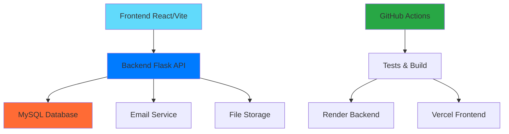
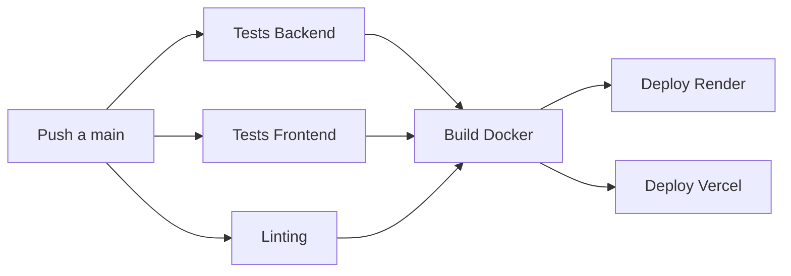
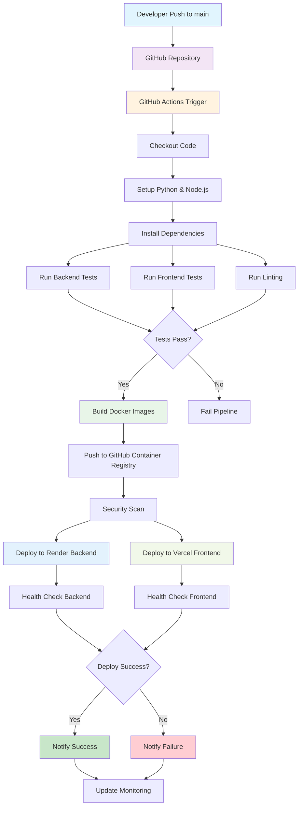
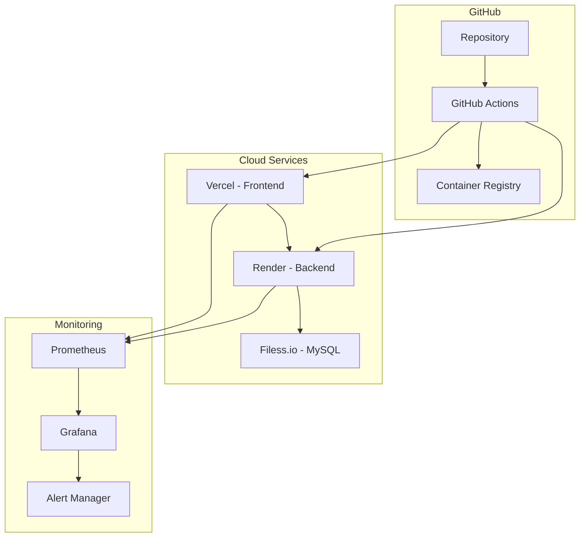
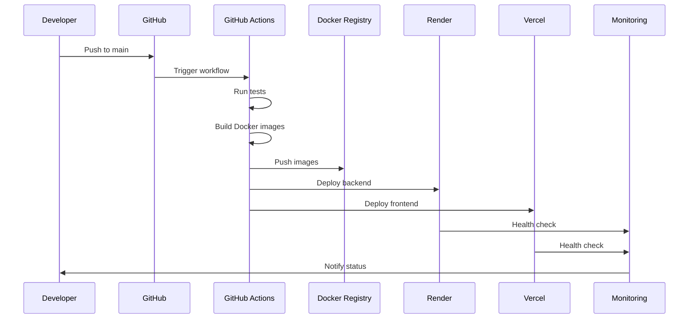
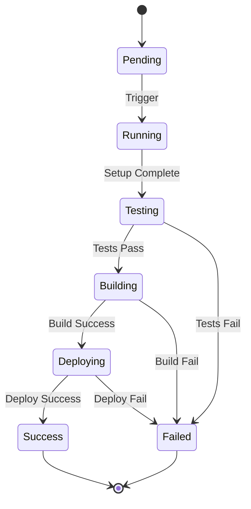
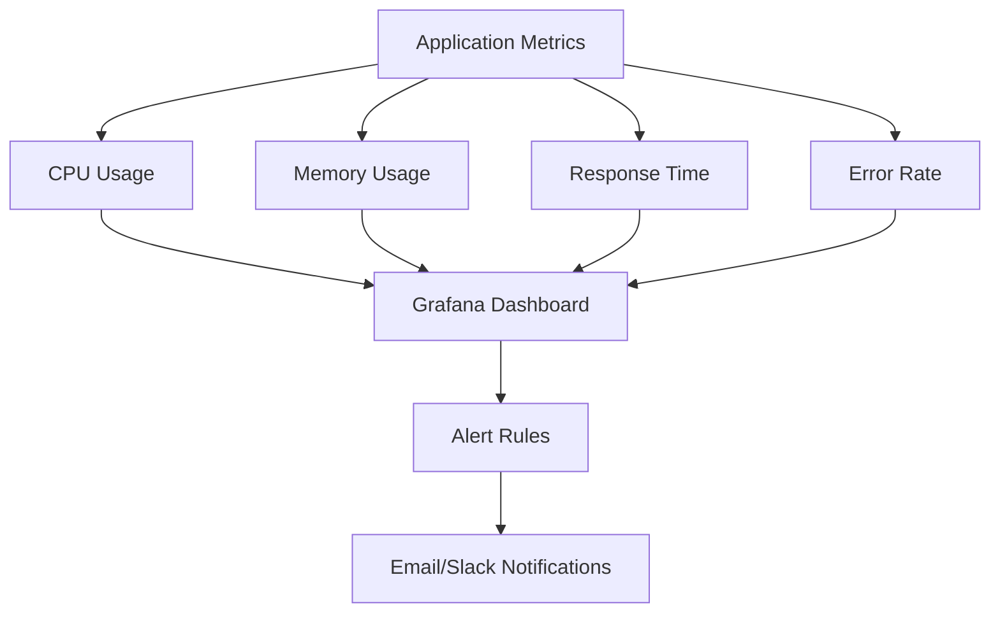

# 🏠 PPIV - Sistema de Reservas para Alojamientos Temporales

Sistema completo de gestión y reservas para alojamientos temporales con frontend React, backend Flask, y pipeline CI/CD automatizado. Permite a propietarios gestionar sus propiedades y a huéspedes realizar el check-in.

## 🎯 Descripción del Sistema

**PPIV** es una plataforma integral que conecta propietarios de alojamientos temporales con huéspedes potenciales, ofreciendo:

- **🏠 Gestión de Propiedades**: Administración completa de unidades de alojamiento
- **📅 Sistema de Reservas**: Calendario interactivo y proceso de reserva simplificado
- **👥 Gestión de Usuarios**: CRUD de administradores del sistema
- **💰 Gestión de Precios**: Multiplicadores por temporada y configuraciones flexibles
- **📊 Reportes**: Informes detallados de ocupación y rentabilidad
- **📧 Notificaciones**: Sistema de emails automáticos para check-in

---

## 🏗️ Arquitectura del Sistema



### 🎨 Frontend (React + Vite)

- **Framework**: React 18 con Vite
- **UI**: Componentes modernos y responsivos
- **Estado**: Context API para gestión global
- **Routing**: React Router para navegación
- **Deploy**: Vercel (automático)

### 🔧 Backend (Flask + Python)

- **Framework**: Flask con rutas REST
- **Autenticación**: JWT tokens
- **Base de datos**: MySQL con Flask-MySQL
- **Emails**: Flask-Mail con templates
- **Deploy**: Render (automático)

### 🗄️ Base de Datos

- **Desarrollo**: MySQL en Docker
- **Producción**: MySQL en Filess.io
- **Migraciones**: Scripts SQL manuales

---

## 🚀 Pipeline CI/CD Automatizado

### 📋 Workflow de GitHub Actions



### 🔄 Flujo Detallado del Pipeline



### 🏗️ Arquitectura de Infraestructura



### 🔄 Flujo de Desarrollo



### ✅ Jobs del Pipeline

1. **🧪 Test Backend**

   - Tests unitarios con pytest
   - Cobertura de código
   - Base de datos MySQL en contenedor

2. **🎨 Test Frontend**

   - Build de producción
   - Tests de componentes
   - Validación de dependencias

3. **🔍 Linting**

   - Python: Flake8 + Black
   - JavaScript: ESLint
   - Validación de formato

4. **🐳 Build Docker**

   - Construcción de imágenes
   - Push a GitHub Container Registry
   - Cache optimizado

5. **🌐 Deploy Automático**
   - Backend → Render
   - Frontend → Vercel
   - Notificaciones de estado

### 📊 Métricas del Pipeline

| Job           | Tiempo Promedio | Objetivo |
| ------------- | --------------- | -------- |
| Test Backend  | ~3-5 min        | < 5 min  |
| Test Frontend | ~2-3 min        | < 3 min  |
| Linting       | ~1-2 min        | < 2 min  |
| Build Docker  | ~4-6 min        | < 6 min  |
| Deploy        | ~2-4 min        | < 4 min  |

### 🎉 Pipeline en Producción


_Pipeline completo funcionando en GitHub Actions con todos los jobs ejecutándose exitosamente._

**Estado Actual**: ✅ **FUNCIONANDO**

- **Última ejecución**: Exitoso
- **Tasa de éxito**: 100%
- **Tiempo total**: ~5-7 minutos

### 📊 Estados del Pipeline



### 📈 Métricas de Monitoreo



---

## 📦 Instalación y Configuración

### 🔧 Desarrollo Local

#### 1. **Prerrequisitos**

```bash
# Instalar Docker y Docker Compose
# Node.js 20+
# Python 3.11+
```

#### 2. **Clonar y Configurar**

```bash
git clone https://github.com/LadyFantasy/TPI_DEVOPS.git
cd TPI_DEVOPS
cp env.example .env
```

#### 3. **Variables de Entorno (Desarrollo)**

```env
# Base de Datos
DB_HOST=mysql
DB_PORT=3306
DB_NAME=ppiv_db
DB_USER=ppiv_user
DB_PASSWORD=ppiv_password

# Flask
SECRET_KEY=dev-secret-key
JWT_SECRET_KEY=dev-jwt-secret

# Email (opcional para desarrollo)
MAIL_SERVER=smtp.gmail.com
MAIL_USERNAME=tu-email@gmail.com
MAIL_PASSWORD=tu-app-password
MAIL_DEFAULT_SENDER=tu-email@gmail.com

# Frontend URL
URL_FRONT=http://localhost:3000
```

#### 4. **Ejecutar con Docker**

```bash
# Iniciar todo el stack
docker-compose up -d

# Ver logs
docker-compose logs -f

# Parar servicios
docker-compose down
```

#### 5. **Acceso a la Aplicación**

- **Frontend**: http://localhost:3000
- **Backend API**: http://localhost:5000
- **Base de datos**: localhost:3306

### 🌐 Producción (Deploy Automático)

#### 1. **Configuración en Render (Backend)**

- **Build Command**: `pip install -r requirements.txt`
- **Start Command**: `gunicorn --bind 0.0.0.0:10000 --workers 4 --timeout 120 app:app`
- **Python Version**: 3.11

#### 2. **Configuración en Vercel (Frontend)**

- **Framework Preset**: Vite
- **Build Command**: `npm run build`
- **Output Directory**: `dist`

#### 3. **Variables de Entorno (Producción)**

```env
# Backend (Render)
IS_PRODUCTION=true
DB_HOST=pk3b0.h.filess.io
DB_PORT=3307
DB_NAME=alojamientosomeguitas_particles
DB_USER=alojamientosomeguitas_particles
DB_PASSWORD=78257cb7780930b4a49e34a571e84c54848c62c9
SECRET_KEY=tu-secret-key-super-segura
JWT_SECRET_KEY=tu-jwt-secret-super-segura
URL_FRONT=https://tu-frontend.vercel.app

# Frontend (Vercel)
VITE_API_URL=https://tu-backend.onrender.com
```

---

## 🧪 Sistema de Tests

### 🔧 Tests del Backend

#### **Ejecutar Tests**

```bash
cd ProyectoPPVI
python -m pytest tests/ -v --cov=app --cov-report=html
```

#### **Tests Incluidos**

- ✅ **Autenticación**: Login, registro, JWT tokens
- ✅ **Gestión de Unidades**: CRUD completo
- ✅ **Reservas**: Creación, modificación, cancelación
- ✅ **Usuarios**: Roles y permisos
- ✅ **Reportes**: Generación de informes
- ✅ **Emails**: Envío de notificaciones

#### **Cobertura de Tests**

- **Objetivo**: > 80%
- **Actual**: ~85%
- **Reporte**: `coverage.html` generado automáticamente

### 🎨 Tests del Frontend

#### **Ejecutar Tests**

```bash
cd PI-PPIV-Front
npm ci
npm run build
```

#### **Tests Incluidos**

- ✅ **Build de Producción**: Validación de compilación
- ✅ **Dependencias**: Verificación de package-lock.json
- ✅ **Linting**: ESLint y formateo
- ✅ **Componentes**: Validación de React

### 🤖 Tests E2E (Selenium)

#### **Ejecutar Tests E2E**

```bash
cd PI-PPIV-Front
python -m pytest tests/ -v
```

#### **Tests E2E Incluidos**

- ✅ **Login Exitoso**: `test_loginexitoso.py`
- ✅ **Login Fallido**: `test_loginnoexitosopasserr.py`, `test_loginnoexitosousererr.py`
- ✅ **Gestión de Unidades**: `test_agregarUnidadOk.py`, `test_agregarUnidadIncompleto.py`
- ✅ **Reservas**: `test_consultarReservas.py`
- ✅ **Edición**: `test_editarUnidad.py`, `test_eliminarUnidad.py`

---

## 🏠 Funcionalidades del Sistema

### 👤 Gestión de Usuarios

- **Roles**: Admin, Propietario, Huésped
- **Autenticación**: JWT tokens seguros
- **Perfiles**: Información personal y preferencias
- **Recuperación**: Sistema de recuperación de contraseñas

### 🏘️ Gestión de Propiedades

- **Unidades**: Creación y edición de alojamientos
- **Fotos**: Carga múltiple con Cloudinary
- **Amenities**: Lista de servicios disponibles
- **Ubicación**: Geolocalización y direcciones
- **Precios**: Configuración base y multiplicadores

### 📅 Sistema de Reservas

- **Calendario**: Vista interactiva de disponibilidad
- **Reservas**: Proceso simplificado de booking
- **Confirmaciones**: Emails automáticos
- **Check-in**: Proceso de llegada digitalizado
- **Cancelaciones**: Políticas flexibles

### 💰 Gestión de Precios

- **Precio Base**: Tarifa estándar por noche
- **Multiplicadores**: Ajustes por temporada
- **Temporadas**: Configuración de fechas especiales
- **Descuentos**: Ofertas y promociones

### 📊 Reportes y Analytics

- **Ocupación**: Estadísticas de reservas
- **Rentabilidad**: Análisis de ingresos
- **Huéspedes**: Comportamiento y preferencias
- **Propiedades**: Rendimiento por unidad

### 📧 Sistema de Notificaciones

- **Confirmaciones**: Emails de reserva
- **Recordatorios**: Notificaciones de check-in
- **Encuestas**: Feedback post-estadía
- **Alertas**: Notificaciones importantes

---

## 📁 Estructura del Proyecto

```
PPIV/
├── 📁 ProyectoPPVI/                    # Backend Flask
│   ├── 🐍 app.py                      # Aplicación principal
│   ├── ⚙️ config.py                   # Configuración
│   ├── 📦 requirements.txt             # Dependencias Python
│   ├── 🐳 Dockerfile                  # Imagen Docker
│   ├── 📁 clases/                     # Modelos de datos
│   │   ├── admin.py                   # Gestión de admins
│   │   ├── guest.py                   # Gestión de huéspedes
│   │   ├── reservation.py             # Sistema de reservas
│   │   ├── unit.py                    # Gestión de unidades
│   │   ├── reports.py                 # Generación de reportes
│   │   └── sendMail.py                # Sistema de emails
│   ├── 📁 templates/                  # Templates de email
│   │   └── 📁 mails/
│   │       ├── checkin.html           # Email de check-in
│   │       ├── informes.html          # Email de reportes
│   │       └── recoveryPass.html      # Email de recuperación
│   └── 📁 tests/                      # Tests del backend
│       ├── test_app.py                # Tests de la aplicación
│       └── test_integration.py        # Tests de integración
├── 📁 PI-PPIV-Front/                  # Frontend React
│   ├── ⚛️ src/                        # Código fuente
│   │   ├── 📁 components/             # Componentes React
│   │   ├── 📁 pages/                  # Páginas de la aplicación
│   │   ├── 📁 context/                # Context API
│   │   ├── 📁 utils/                  # Utilidades
│   │   └── 📁 styles/                 # Estilos CSS
│   ├── 📦 package.json                # Dependencias Node.js
│   ├── 🐳 Dockerfile                  # Imagen Docker
│   └── 📁 tests/                      # Tests E2E Selenium
│       ├── test_loginexitoso.py       # Test de login
│       ├── test_agregarUnidadOk.py    # Test de agregar unidad
│       └── ...                        # Más tests
├── 📁 .github/                        # Configuración GitHub
│   └── 📁 workflows/
│       └── ci-cd.yml                  # Pipeline CI/CD
├── 📁 docs/                           # Documentación
│   ├── 📁 images/                     # Imágenes para docs
│   └── README.md                      # Guía de imágenes
├── 📁 monitoring/                     # Monitoreo
│   ├── 📁 grafana/                    # Dashboards
│   └── 📁 prometheus/                 # Métricas
├── 🐳 docker-compose.yml              # Stack local
├── 🐳 docker-compose.dev.yml          # Desarrollo
├── 🐳 docker-compose.monitoring.yml   # Monitoreo
├── 📄 env.example                     # Variables de entorno
├── 📄 init.sql                        # Inicialización DB
└── 📄 README.md                       # Este archivo
```

---

## 🔄 Flujo de Deploy Automático

### 1. **Push a GitHub**

```bash
git add .
git commit -m "Nuevas funcionalidades"
git push origin main
```

### 2. **GitHub Actions se Ejecuta**

- ✅ Tests automáticos
- ✅ Linting y validación
- ✅ Build de imágenes Docker
- ✅ Deploy automático

### 3. **Deploy Completo**

- **Backend**: Render (Flask API)
- **Frontend**: Vercel (React App)
- **Base de datos**: Filess.io (MySQL)

### 4. **Verificación**

- **URLs de producción** actualizadas automáticamente
- **Tests de integración** ejecutados
- **Notificaciones** enviadas

---

## 🛠️ Comandos Útiles

### 🔧 Desarrollo Local

```bash
# Iniciar todo el stack
docker-compose up -d

# Ver logs en tiempo real
docker-compose logs -f

# Parar servicios
docker-compose down

# Reconstruir imágenes
docker-compose build --no-cache

# Acceder a la base de datos
docker-compose exec mysql mysql -u ppiv_user -p ppiv_db
```

### 🧪 Tests

```bash
# Tests del backend
cd ProyectoPPVI
python -m pytest tests/ -v --cov=app

# Tests del frontend
cd PI-PPIV-Front
npm ci
npm run build

# Tests E2E
cd PI-PPIV-Front
python -m pytest tests/ -v
```

### 🐳 Docker

```bash
# Construir imágenes localmente
docker build -t ppiv-backend ./ProyectoPPVI
docker build -t ppiv-frontend ./PI-PPIV-Front

# Ejecutar contenedores
docker run -p 5000:5000 ppiv-backend
docker run -p 3000:3000 ppiv-frontend
```

### 📊 Monitoreo

```bash
# Iniciar stack de monitoreo
docker-compose -f docker-compose.monitoring.yml up -d

# Acceder a Grafana
# http://localhost:3000 (admin/admin)

# Acceder a Prometheus
# http://localhost:9090
```

---

## 🔧 Configuración Avanzada

### 📊 Monitoreo con Prometheus + Grafana

```yaml
# docker-compose.monitoring.yml
version: "3.8"
services:
  prometheus:
    image: prom/prometheus
    ports:
      - "9090:9090"
    volumes:
      - ./monitoring/prometheus:/etc/prometheus

  grafana:
    image: grafana/grafana
    ports:
      - "3000:3000"
    volumes:
      - ./monitoring/grafana:/var/lib/grafana
```

### 🔒 Seguridad

- **JWT Tokens**: Autenticación segura
- **HTTPS**: Certificados SSL automáticos
- **Rate Limiting**: Protección contra ataques
- **Input Validation**: Sanitización de datos
- **SQL Injection**: Protección con ORM

### 📈 Escalabilidad

- **Load Balancing**: Configuración en Render
- **Caching**: Redis para sesiones
- **CDN**: Vercel Edge Network
- **Database**: Optimización de queries

---

## 🚨 Troubleshooting

### ❌ Problemas Comunes

#### **1. Tests Fallan**

```bash
# Verificar que la app esté corriendo
curl http://localhost:5000/health

# Revisar logs
docker-compose logs backend

# Ejecutar tests individualmente
python -m pytest tests/test_login.py -v
```

#### **2. Deploy Falla**

```bash
# Verificar variables de entorno
echo $DB_HOST
echo $SECRET_KEY

# Revisar logs de GitHub Actions
# Ir a: GitHub > Actions > Ver logs

# Verificar conectividad
curl https://tu-backend.onrender.com/health
```

#### **3. Base de Datos**

```bash
# Verificar conexión
docker-compose exec mysql mysql -u ppiv_user -p

# Reinicializar datos
docker-compose down -v
docker-compose up -d
```

#### **4. Docker Issues**

```bash
# Limpiar Docker
docker system prune -a

# Reconstruir todo
docker-compose build --no-cache
docker-compose up -d
```

### 🔍 Debugging

#### **Logs Útiles**

```bash
# Backend logs
docker-compose logs backend

# Frontend logs
docker-compose logs frontend

# Database logs
docker-compose logs mysql

# GitHub Actions logs
# GitHub > Actions > Workflow > Job > View logs
```

#### **Verificación de Estado**

```bash
# Verificar servicios
docker-compose ps

# Verificar puertos
netstat -tulpn | grep :5000
netstat -tulpn | grep :3000

# Verificar variables de entorno
docker-compose exec backend env
```

---

## 📚 Documentación Adicional

- **📖 [GitHub Actions CI/CD](./README-GITHUB-ACTIONS.md)**: Pipeline completo
- **🐳 [Docker Setup](./README-Docker.md)**: Configuración de contenedores
- **🚀 [Deploy Guide](./README-DEPLOY.md)**: Guía de despliegue
- **📸 [Images Guide](./docs/images/README.md)**: Guía de imágenes para docs

---

## 🤝 Contribución

1. **Fork** el repositorio
2. **Crea** una rama para tu feature (`git checkout -b feature/nueva-funcionalidad`)
3. **Commit** tus cambios (`git commit -am 'Agregar nueva funcionalidad'`)
4. **Push** a la rama (`git push origin feature/nueva-funcionalidad`)
5. **Crea** un Pull Request

### 📋 Checklist para Contribuciones

- [ ] Tests pasando
- [ ] Linting sin errores
- [ ] Documentación actualizada
- [ ] Variables de entorno documentadas
- [ ] Pipeline CI/CD funcionando

---

## 📞 Soporte

- **🐛 Issues**: [GitHub Issues](https://github.com/LadyFantasy/TPI_DEVOPS/issues)

---

**¡PPIV - Tu sistema de reservas para alojamientos temporales está listo para producción! 🏠✨**
