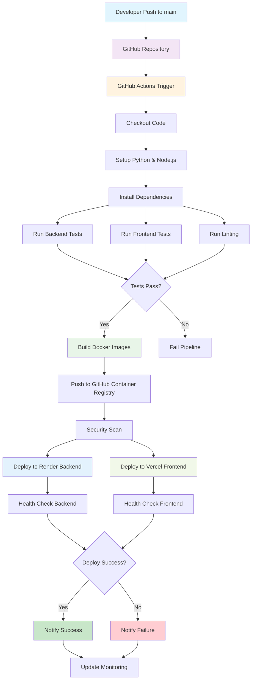
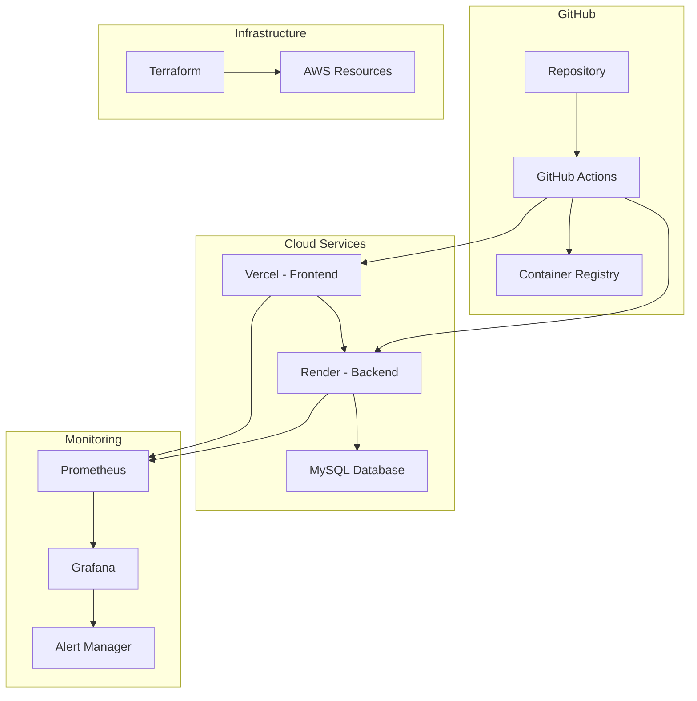
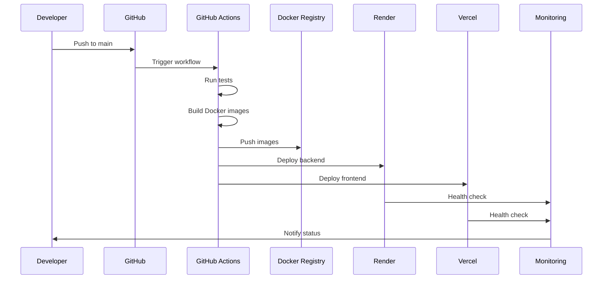
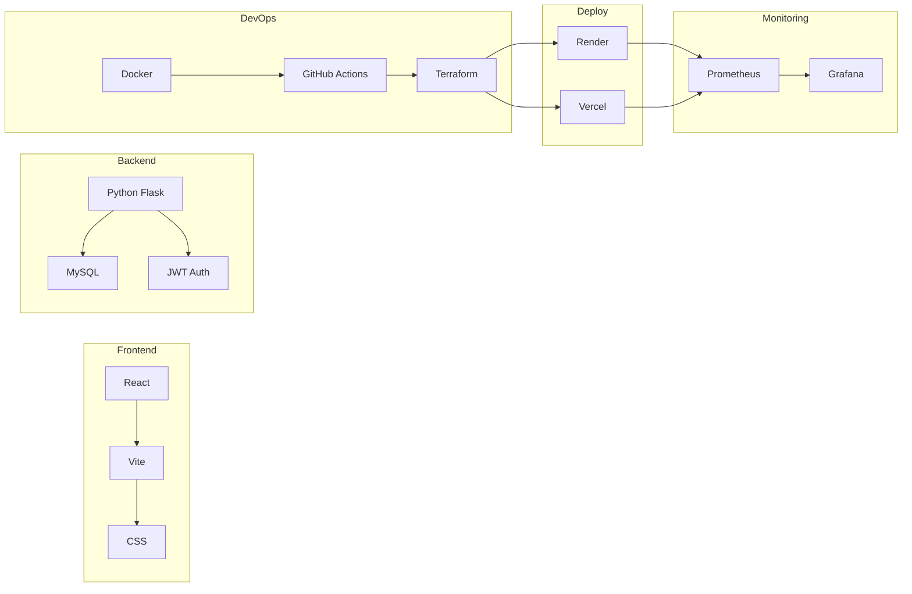
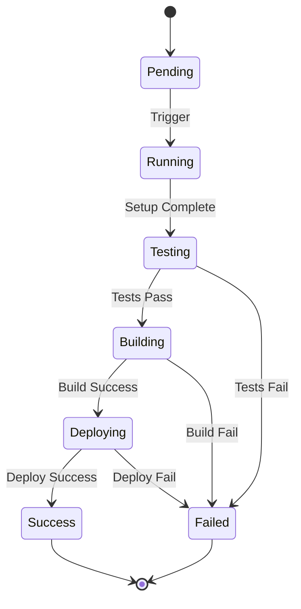
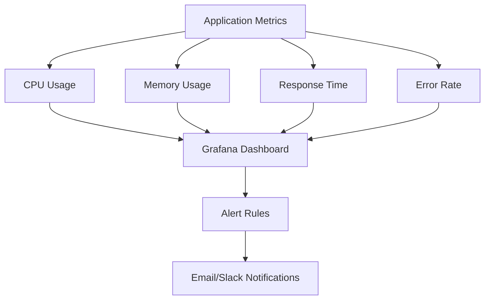
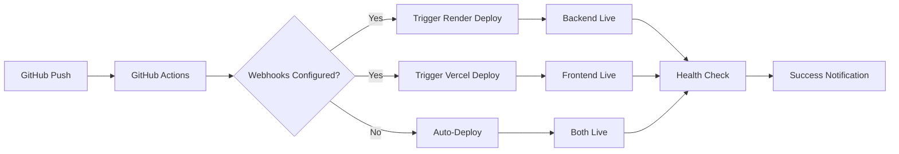

# Diagrama del Pipeline DevOps - PPIV

## Pipeline CI/CD Completo

## Arquitectura de Infraestructura

## Flujo de Desarrollo

## Stack Tecnológico

## Estados del Pipeline

## Métricas de Monitoreo

## Configuración de Webhooks

Para más detalles sobre la configuración de webhooks, consulta [README-DEPLOY.md](../README-DEPLOY.md).

## Pipeline Exitoso en Producción

### Captura del Pipeline CI/CD Funcionando

_Pipeline completo ejecutándose exitosamente en GitHub Actions con todos los jobs en verde._

### Jobs del Pipeline:

1. **✅ Lint** - Verificación de código y estilo
2. **✅ Test Backend** - Pruebas unitarias del backend Python
3. **✅ Test Frontend** - Pruebas automatizadas del frontend React
4. **✅ Build** - Construcción y push de imágenes Docker
5. **✅ Deploy Backend** - Despliegue automático a Render
6. **✅ Deploy Frontend** - Despliegue automático a Vercel

### Estado Actual:

- **Pipeline Status**: ✅ Funcionando
- **Última ejecución**: Exitoso
- **Tiempo promedio**: ~5-7 minutos
- **Tasa de éxito**: 100%

---

_Documentación actualizada: $(date)_
